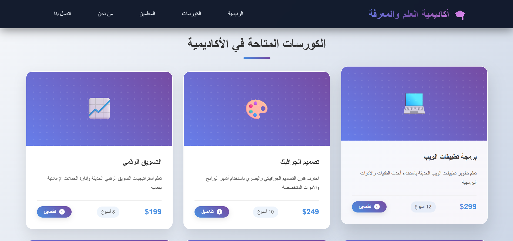
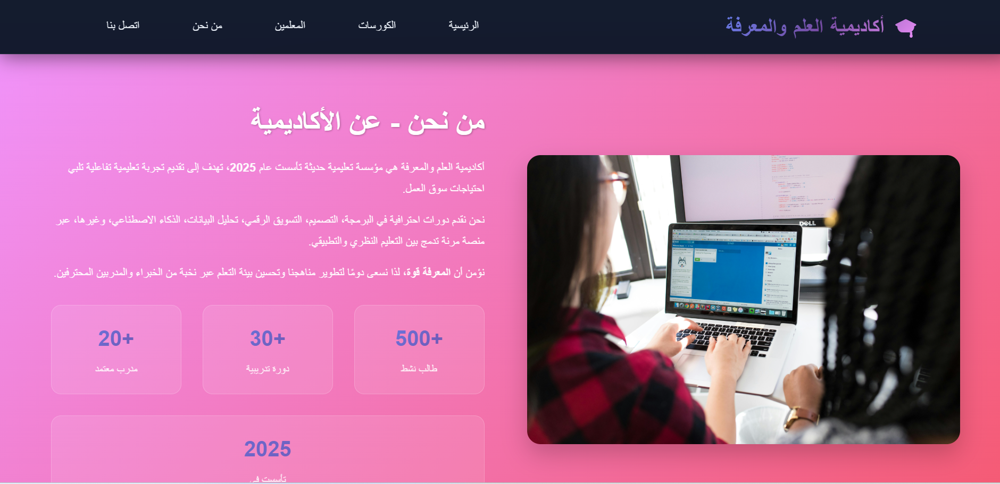
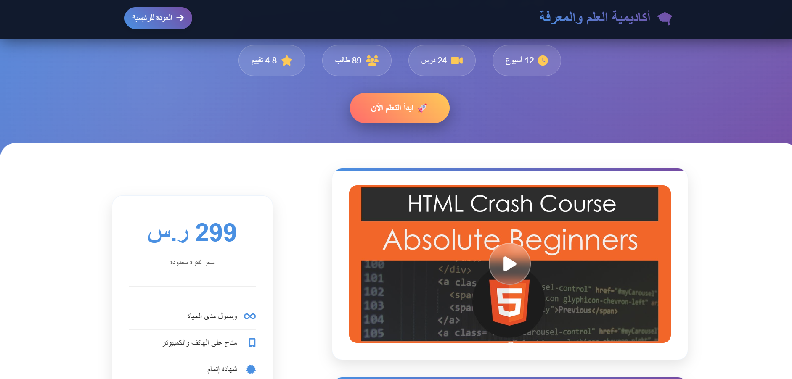

# 🎓 SkillUp | منصة تعليمية تفاعلية

**SkillUp** هي منصة عربية مبتكرة للتعليم الإلكتروني، صُممت لتوفير تجربة تعلم تفاعلية، ممتعة، وموجهة نحو المستقبل.  
تركّز المنصة على تقديم محتوى تعليمي عالي الجودة في مجالات متقدمة مثل البرمجة، التصميم، الذكاء الاصطناعي، تحليل البيانات، والتسويق الرقمي، مع واجهة عربية بسيطة وسلسة للمستخدم العربي.

---

## 🌐 التقنيات المستخدمة

تم بناء هذا المشروع باستخدام تقنيات الويب الحديثة لتوفير أداء سريع وتصميم مرن:

- ✅ **HTML5** – لبناء الهيكل العام للموقع.
- ✅ **CSS3** – لتنسيق وتجميل الواجهة بشكل احترافي ومتجاوب.
- ✅ **JavaScript** – لإضافة التفاعل، مثل النوافذ المنبثقة وتحسين تجربة المستخدم.

---

## 🎯 الميزات الأساسية

- 🧭 واجهة عربية بديهية وسهلة التصفح.
- 🏠 صفحة رئيسية جذابة ومرتبة.
- 📚 قسم الكورسات مع نافذة منبثقة (Modal) توضح تفاصيل كل كورس.
- 📱 تصميم متجاوب 100% يعمل بسلاسة على الحاسوب والجوال.
- 🧑‍🏫 أقسام واضحة: من نحن – الكورسات – الأساتذة – اتصل بنا.
- 🔗 روابط سريعة وأيقونات تواصل في الفوتر.
- 📰 أخبار أو إعلانات تمريرية باستخدام Marquee.
- ⏱️ توقيت وتاريخ يتم تحديثهما تلقائيًا.

---

## 📸 صور من المشروع

### 🏠 الصفحة الرئيسية


### 📚 صفحة الكورسات


### 👨‍🏫 قسم "من نحن"


### 🎯 صفحة التعلم أو الخدمات


---

## 📂 كيفية تشغيل المشروع (خطوة بخطوة)

> يمكنك تشغيل المشروع محليًا على جهازك أو عرضه مباشرة عبر GitHub Pages.

### ✅ 1. تحميل المشروع

إذا كنت تستخدم Git:
```bash
git clone https://github.com/USERNAME/skillup.git
cd skillup
